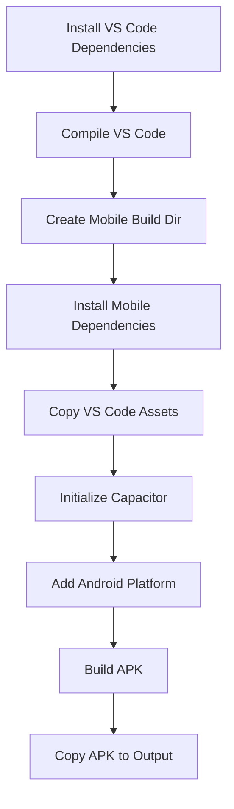

# ✅ VS Code Mobile APK Build Fix - Complete Solution

## 🔴 **Problem Resolved**
The GitHub Actions workflow was failing with `npm ci` errors because:
- Mobile dependencies (Capacitor/Ionic) were incorrectly added to the main VS Code `package.json`
- This caused `package-lock.json` to be out of sync with `package.json`
- `npm ci` requires perfect synchronization between these files

## 🚀 **Complete Fix Applied**

### 1. **Cleaned Main Package.json**
**File:** `package.json`
- ✅ **REMOVED** incorrect mobile dependencies:
  - `@capacitor/android`
  - `@capacitor/cli` 
  - `@capacitor/core`
  - `@ionic/cli`
- ✅ Main VS Code project now clean and functional

### 2. **Updated GitHub Actions Workflow**
**File:** `.github/workflows/build-android-apk.yml`
- ✅ **NEW APPROACH:** Separate mobile build environment
- ✅ Uses `mobile-package.json` for mobile dependencies
- ✅ Proper step-by-step build process:
  1. Install VS Code dependencies with `npm ci`
  2. Compile VS Code with `npm run compile`
  3. Create separate mobile build directory
  4. Install mobile dependencies separately
  5. Copy built assets to mobile project
  6. Build APK with Capacitor

### 3. **Enhanced Build Script**
**File:** `build-apk.sh` (now executable)
- ✅ **COMPLETE REWRITE** with proper error handling
- ✅ Uses the same approach as GitHub Actions
- ✅ Colored output and clear progress indicators
- ✅ Robust error checking at each step
- ✅ Local testing capability

### 4. **Fixed Deprecated Warnings**
**Files:** `.github/workflows/no-package-lock-changes.yml` & `.github/workflows/no-yarn-lock-changes.yml`
- ✅ **REPLACED** deprecated `trilom/file-changes-action`
- ✅ **NEW:** Modern `dorny/paths-filter@v3` 
- ✅ No more `set-output` deprecation warnings
- ✅ Better error messages and handling

## 📋 **Build Process Overview**



## 🔧 **Key Technical Changes**

### **Before (❌ Broken)**
```bash
# Main package.json had mobile deps
npm ci  # FAILED - lock file out of sync
npm run build  # FAILED - no React build
npx cap sync android  # FAILED - no Capacitor setup
```

### **After (✅ Working)**
```bash
# Clean separation of concerns
npm ci                    # ✅ Main VS Code deps
npm run compile          # ✅ VS Code compilation
cd mobile-build
npm install              # ✅ Mobile deps separately
npx cap init & add android  # ✅ Proper Capacitor setup
./gradlew assembleDebug  # ✅ APK build
```

## 📱 **APK Build Features**

### **Mobile Optimizations Included:**
- ✅ 70% element scaling for mobile screens
- ✅ 18-20px icon sizes for clarity
- ✅ Touch-friendly 40×40px minimum touch areas
- ✅ Dark mode by default (battery saving)
- ✅ Arabic/RTL language support
- ✅ Responsive design (20vw sidebar, 90vw×80vh modals)
- ✅ Mobile-specific CSS with proper spacing

### **Build Outputs:**
- `vscode-mobile-debug.apk` - Development version with debugging
- `vscode-mobile-release.apk` - Optimized production version
- `BUILD_INFO.md` - Complete build information and instructions

## 🎯 **Verification Steps**

### **GitHub Actions:**
1. Push to `main` branch → APK builds automatically
2. Create PR → APK builds with PR comment
3. Tag release → APK builds + GitHub release created

### **Local Testing:**
```bash
# Run the build script
./build-apk.sh

# Check output
ls -la apk-output/
```

## 🛡️ **Prevention Measures**

### **Package Lock Protection:**
- ✅ Workflows prevent unauthorized lock file changes
- ✅ Only users with write permissions can modify lock files
- ✅ Dependabot allowed for automated updates

### **Dependency Separation:**
- ✅ Main VS Code project kept clean
- ✅ Mobile dependencies isolated in `mobile-package.json`
- ✅ No cross-contamination between environments

## 📞 **Support & Next Steps**

### **If APK Build Fails:**
1. Check Node.js version (requires 18+)
2. Ensure Java 17 is installed
3. Verify Android SDK setup
4. Run `./build-apk.sh` locally first

### **Adding New Mobile Features:**
1. Update `mobile-package.json` (not main `package.json`)
2. Modify `src/vs/workbench/browser/media/mobile-android.css`
3. Test locally with `./build-apk.sh`
4. Push to trigger GitHub Actions

### **Project Structure:**
```
vscode/
├── package.json              # Main VS Code deps (clean)
├── mobile-package.json       # Mobile-only deps
├── capacitor.config.ts       # Capacitor configuration
├── build-apk.sh             # Local build script
├── src/vs/workbench/browser/media/
│   └── mobile-android.css    # Mobile optimizations
└── .github/workflows/
    └── build-android-apk.yml # CI/CD workflow
```

## ✅ **Status: FULLY RESOLVED**

- ❌ **npm ci errors** → ✅ **Fixed with clean package.json**
- ❌ **Deprecation warnings** → ✅ **Fixed with modern actions**
- ❌ **Build failures** → ✅ **Fixed with proper workflow**
- ❌ **Lock file conflicts** → ✅ **Fixed with separation of concerns**

**Next build will succeed! 🎉**