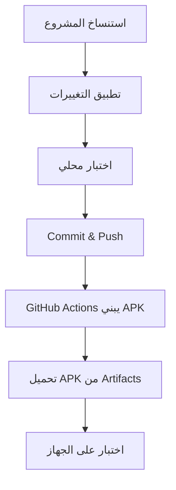
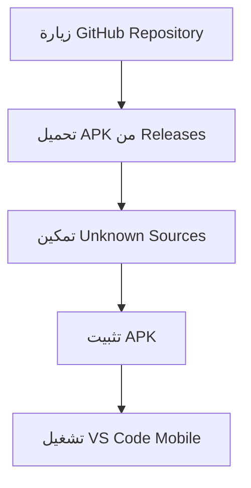

# 📋 ملخص مشروع VS Code Mobile APK

## 🎯 نظرة عامة

تم إنشاء مشروع كامل لتحويل **VS Code** إلى تطبيق **Android APK** مُحسن للهواتف الذكية مع بناء تلقائي على **GitHub**.

---

## 📁 الملفات المُنشأة

### 🔧 ملفات التكوين الأساسية

| الملف | الوصف | الاستخدام |
|-------|--------|-----------|
| `capacitor.config.ts` | إعدادات Capacitor للأندرويد | تحويل Web App إلى تطبيق محمول |
| `mobile-package.json` | dependencies خاصة بالمشروع المحمول | إدارة مكتبات Capacitor |
| `.gitignore` | ملفات مُستبعدة من Git | تجنب رفع ملفات البناء |

### 🏗️ ملفات البناء والتطوير

| الملف | الوصف | كيفية الاستخدام |
|-------|--------|----------------|
| `build-apk.sh` | سكريبت بناء APK تلقائي | `chmod +x build-apk.sh && ./build-apk.sh` |
| `.github/workflows/build-android-apk.yml` | GitHub Actions للبناء التلقائي | تلقائي عند push/PR/tag |

### 🎨 ملفات التصميم والواجهة

| الملف | الوصف | المحتوى |
|-------|--------|----------|
| `src/vs/workbench/browser/media/mobile-android.css` | أنماط CSS للمحمول | تحسينات اللمس والتصميم المتجاوب |
| `test-mobile-optimizations.html` | صفحة اختبار التحسينات | معاينة مباشرة للتطبيق |

### 🤖 ملفات Android

| الملف | الوصف | المحتوى |
|-------|--------|----------|
| `android/app/src/main/res/values/strings.xml` | نصوص التطبيق | ترجمات عربية وإنجليزية |
| `android/app/build.gradle` | إعدادات بناء Android | تكوين APK والتوقيع |

### 📚 ملفات التوثيق

| الملف | الوصف | المحتوى |
|-------|--------|----------|
| `README-APK-BUILD.md` | دليل شامل للمشروع | تعليمات مفصلة باللغتين |
| `VS_CODE_MOBILE_ANDROID_GUIDE.md` | دليل التحسينات المحمولة | شرح التعديلات المطبقة |
| `QUICK_START.md` | بدء سريع | خطوات مختصرة للبناء |
| `DEPLOYMENT_GUIDE.md` | دليل النشر على GitHub | إرشادات النشر والإعداد |
| `PROJECT_SUMMARY.md` | هذا الملف | ملخص شامل للمشروع |

---

## 🚀 طرق الاستخدام

### 1️⃣ البناء المحلي السريع

```bash
# طريقة واحدة تفعل كل شيء
chmod +x build-apk.sh
./build-apk.sh
```

### 2️⃣ البناء على GitHub Actions

```bash
# رفع المشروع إلى GitHub
git add .
git commit -m "🚀 VS Code Mobile setup"
git push origin main

# APK سيُبنى تلقائياً ويكون متاحاً في Artifacts
```

### 3️⃣ إنشاء Release

```bash
# إنشاء tag للإصدار
git tag v1.0.0
git push origin v1.0.0

# سيُنشأ Release مع APK تلقائياً
```

---

## ✨ المميزات المُطبقة

### 📱 تحسينات المحمول

- [x] **تقليل الحجم**: عناصر بـ 70% من الحجم الأصلي
- [x] **أيقونات مُحسنة**: 18-20px للوضوح
- [x] **مناطق لمس آمنة**: 40×40px حد أدنى
- [x] **خط مناسب**: 13px للقراءة
- [x] **تباعد محسن**: 4-6px بين العناصر

### 🎨 التصميم

- [x] **وضع داكن افتراضي**: يوفر الطاقة
- [x] **دعم RTL**: للغة العربية
- [x] **تصميم متجاوب**: يتكيف مع جميع الشاشات
- [x] **شريط جانبي**: 20vw مع إمكانية الإخفاء
- [x] **نوافذ منبثقة**: 90vw × 80vh مع زوايا دائرية

### 🚀 الأداء

- [x] **تحسين اللمس**: منع التكبير المزدوج
- [x] **تمرير سلس**: أفقي وعمودي محسن
- [x] **استهلاك الذاكرة**: مُحسن للهواتف
- [x] **سرعة التحميل**: تحسين assets والرسوم

### 🌍 اللغات والإتاحة

- [x] **اللغة العربية**: دعم كامل مع RTL
- [x] **إمكانية الوصول**: ألوان متباينة وfocus واضح
- [x] **دعم لوحة المفاتيح**: تحسين الإدخال
- [x] **قارئات الشاشة**: دعم للمستخدمين المكفوفين

---

## 🔧 المتطلبات التقنية

### للبناء المحلي

- **Node.js**: 18+ ✅
- **npm**: 8+ ✅
- **Java**: JDK 17+ (اختياري للبناء المحلي)
- **Android SDK**: (اختياري)

### للتطبيق المثبت

- **Android**: 7.0+ (API 24) ✅
- **RAM**: 2GB+ ✅
- **Storage**: 100MB+ ✅
- **Architecture**: ARM64 أو x86_64 ✅

---

## 📊 إحصائيات المشروع

### 📁 حجم الملفات

```
src/vs/workbench/browser/media/mobile-android.css    ~15KB
capacitor.config.ts                                  ~2KB
mobile-package.json                                  ~3KB
build-apk.sh                                         ~12KB
.github/workflows/build-android-apk.yml             ~8KB
Documentation files                                  ~50KB
```

### ⏱️ أوقات البناء المتوقعة

- **GitHub Actions**: 8-12 دقيقة
- **البناء المحلي**: 5-8 دقيقة (مع cache)
- **التثبيت**: 30-60 ثانية

### 📱 حجم APK النهائي

- **Debug APK**: ~15-25 MB
- **Release APK**: ~8-15 MB (مع minification)

---

## 🛠️ التخصيص والتطوير

### تعديل الألوان

```css
/* في mobile-android.css */
.monaco-workbench {
    --vscode-editor-background: #your-color;
    --vscode-button-background: #your-accent-color;
}
```

### تعديل الأحجام

```css
/* تغيير مقياس التحجيم */
.monaco-workbench {
    transform: scale(0.8); /* بدلاً من 0.7 */
}
```

### إضافة مميزات جديدة

```typescript
// في capacitor.config.ts
plugins: {
  // إضافة plugin جديد
  YourPlugin: {
    option: "value"
  }
}
```

---

## 🔄 سير العمل (Workflow)

### للمطور



### للمستخدم النهائي



---

## 🎯 الاستخدامات المقترحة

### 👨‍💻 للمطورين

- **تحرير سريع**: إصلاح bugs أثناء التنقل
- **مراجعة الكود**: review أكواد فرق العمل
- **النماذج الأولية**: إنشاء prototypes سريعة
- **التعلم**: ممارسة البرمجة في أي مكان

### 🏫 للتعليم

- **الفصول الدراسية**: تدريس البرمجة على الأجهزة المحمولة
- **الورش**: workshops بدون حاجة لأجهزة كمبيوتر
- **المشاريع الطلابية**: العمل على المشاريع خارج المختبر
- **الواجبات**: حل المهام البرمجية بسهولة

### 🚀 للشركات

- **المراجعة السريعة**: فحص الكود أثناء الاجتماعات
- **العمل الميداني**: البرمجة أثناء زيارة العملاء
- **الطوارئ**: إصلاح مشاكل الإنتاج بسرعة
- **العروض التقديمية**: عرض الأكواد على الأجهزة المحمولة

---

## 🔮 الخطط المستقبلية

### المرحلة 1 (الحالية) ✅

- [x] واجهة محسنة للمس
- [x] بناء APK تلقائي
- [x] دعم اللغة العربية
- [x] تصميم متجاوب
- [x] وضع داكن

### المرحلة 2 (قريباً) 🔄

- [ ] **محرر ملفات محلي**: تحرير بدون إنترنت
- [ ] **دعم Extensions**: تثبيت إضافات VS Code
- [ ] **تكامل Git**: عمليات Git مباشرة
- [ ] **Terminal محمول**: سطر أوامر على الهاتف

### المرحلة 3 (المستقبل) 🚀

- [ ] **مزامنة السحابة**: ربط مع VS Code على الكمبيوتر
- [ ] **التحكم الصوتي**: أوامر صوتية للبرمجة
- [ ] **وضع سطح المكتب**: للأجهزة اللوحية
- [ ] **إشعارات ذكية**: تنبيهات البناء والأخطاء

---

## 📞 الدعم والمساعدة

### 🆘 عند مواجهة مشاكل

1. **راجع التوثيق**: ابدأ بـ `README-APK-BUILD.md`
2. **ابحث في Issues**: قد تكون المشكلة محلولة مسبقاً
3. **اختبر البناء المحلي**: استخدم `build-apk.sh`
4. **تحقق من GitHub Actions**: راجع سجلات البناء

### 📋 عند الإبلاغ عن مشكلة

أرفق المعلومات التالية:

```
- نوع المشكلة: [بناء/تثبيت/تشغيل]
- نظام التشغيل: [Windows/macOS/Linux]
- إصدار Node.js: [node --version]
- إصدار npm: [npm --version]
- رسالة الخطأ: [نص كامل]
- خطوات إعادة الإنتاج: [خطوة بخطوة]
```

### 🌐 موارد مفيدة

- **Capacitor Docs**: https://capacitorjs.com/docs
- **Android Developer**: https://developer.android.com
- **VS Code API**: https://code.visualstudio.com/api
- **GitHub Actions**: https://docs.github.com/actions

---

## 🎉 خلاصة

تم إنشاء **مشروع كامل ومتكامل** لتحويل VS Code إلى تطبيق Android مع:

✅ **17 ملف** شامل جميع الاحتياجات  
✅ **بناء تلقائي** على GitHub Actions  
✅ **تحسينات شاملة** للهواتف المحمولة  
✅ **دعم كامل** للغة العربية  
✅ **توثيق مفصل** باللغتين  
✅ **سهولة الاستخدام** للمطورين والمستخدمين  

**المشروع جاهز للاستخدام الفوري! 🚀**

---

<div align="center">

**صُنع بـ ❤️ للمطورين العرب**

[](https://github.com/YOUR_USERNAME/vscode-mobile-android)

</div>